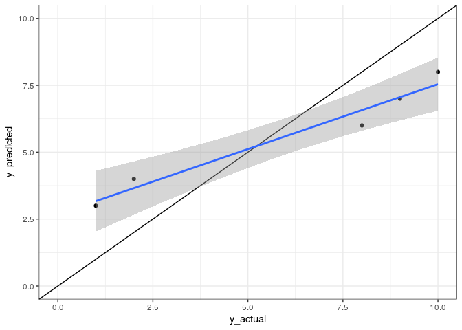

Chapter 3
================
Mauro

# [A Review of the Predictive Modeling Process](http://www.feat.engineering/review-predictive-modeling-process.html)

# Outline

  - Summary
  - My opinion
  - Demo-ish

# Summary

## Goal

Understand the predictive modeling process before feature engineering.

## How to use this chapter

Use it as a guide to answer questions like these:

  - How will you measure the model’s performance?
  - How will you resample the data?
  - How will you tune the model parameters.

If you get this wrong, you’ll likely waste time and achieve poor
results.

## Main takeaways

Try to know as much as possible about:

  - the data;
  - the mechanism that generated the data;
  - the questions you want to answer.

# My opinion: Good

  - Exposes important concepts
  - Shares real-world experience

# My opinion: Bad

## It’s hard to read

This is not only unclear but irritating:

> When multiple models are in contention, there is often the need to
> have formal evaluations between them to understand if any differences
> in performance are above and beyond what one would expect at random.

## Please don’t be such a scientist\!


## Understand what the reader needs

> If the reader is to grasp what the writer means, the writer must
> understand what the reader needs.

– [The Science of Scientific Writing, by George Gopen, Judith
Swan](https://georgegopen.com/wp-content/uploads/2019/12/The-Science-of-Scientific-Writing-1.pdf)

## It’s hard to reproduce

``` r
library(fs)
library(purrr)
```

``` r
chapter_dir <- here::here("03_A_Review_of_the_Predictive_Modeling_Process")
r_files <- fs::dir_ls(chapter_dir, regexp = "[.]R$")
fs::path_file(r_files)
#> [1] "03_02_01_Regression_Metric.R"         
#> [2] "03_02_02_Classification_Metric.R"     
#> [3] "03_06_Model_Optimization_and_Tuning.R"
```

``` r
source(r_files[[1]])
#> Warning in readChar(con, 5L, useBytes = TRUE): cannot open compressed file '../
#> 01_Introduction/1_03_A_More_Complex_Example/lm_date_only.RData', probable reason
#> 'No such file or directory'
#> Error in readChar(con, 5L, useBytes = TRUE): cannot open the connection
warnings()
```

``` r
source(r_files[[2]])
#> Warning in readChar(con, 5L, useBytes = TRUE): cannot open compressed file '../
#> 05_Encoding_Categorical_Predictors/5_06_Creating_Features_from_Text_Data//
#> okc_glm_keyword.RData', probable reason 'No such file or directory'
#> Error in readChar(con, 5L, useBytes = TRUE): cannot open the connection
warnings()
```

``` r
source(r_files[[3]])
#> Warning in readChar(con, 5L, useBytes = TRUE): cannot open compressed file '../
#> 05_Encoding_Categorical_Predictors/5_06_Creating_Features_from_Text_Data//
#> okc_knn_keyword.RData', probable reason 'No such file or directory'
#> Error in readChar(con, 5L, useBytes = TRUE): cannot open the connection
warnings()
```

## Sure I can get the files from Git’s history, right?

``` bash
git log --name-only | grep lm_date_only
git log --name-only | grep okc_knn_keyword
#> 01_Introduction/1_03_A_More_Complex_Example/lm_date_only.R
#> 05_Encoding_Categorical_Predictors/05_06_Creating_Features_from_Text_Data/okc_knn_keyword.RData
#> 05_Encoding_Categorical_Predictors/5_06_Creating_Features_from_Text_Data/okc_knn_keyword.RData
```

``` bash
FILE='05_Encoding_Categorical_Predictors/5_06_Creating_Features_from_Text_Data/okc_knn_keyword.RData'

git log -- $FILE
```

``` bash
git log 3f522d --stat
#> commit 3f522d743c01456efcff332b568269ce06432b1f
#> Author: Max Kuhn <mxkuhn@gmail.com>
#> Date:   Tue Jun 18 17:50:53 2019 -0400
#> 
#>     fixed naming inconsistency
#> 
#>  .../modeling.R                                              |   0
#>  .../modeling.Rout                                           |   0
#>  .../okc_dff.RData                                           | Bin
#>  .../okc_glm_basic.RData                                     | Bin
#>  .../okc_glm_keyword.RData                                   | Bin
#>  .../okc_glm_rs.RData                                        | Bin
#>  .../okc_glm_sent.RData                                      | Bin
#>  .../okc_glm_text.RData                                      | Bin
#>  .../okc_knn_keyword.RData                                   | Bin
#>  .../okc_mlp_keyword.RData                                   | Bin
#>  10 files changed, 0 insertions(+), 0 deletions(-)
#> 
#> commit 024c98e7911544474353002cdabf055e774bde8b
#> Author: Max Kuhn <mxkuhn@gmail.com>
#> Date:   Tue Jun 18 17:44:43 2019 -0400
#> 
#>     cover art in readme
#> 
#>  README.md |   6 +++++-
#>  cover.jpg | Bin 0 -> 29976 bytes
#>  2 files changed, 5 insertions(+), 1 deletion(-)
#> 
#> commit 1e17d7e7c43f29f31f8504eff8b273c61b6aad33
#> Author: Max Kuhn <mxkuhn@gmail.com>
#> Date:   Tue Jun 18 17:34:58 2019 -0400
#> 
#>     updated and added links to purchase
#> 
#>  README.md | 15 ++++++---------
#>  1 file changed, 6 insertions(+), 9 deletions(-)
#> 
#> commit 3f020125e6542fe50e7f55ed589bcf55f115fd64
#> Author: Max Kuhn <mxkuhn@gmail.com>
#> Date:   Tue Jun 18 17:22:38 2019 -0400
#> 
#>     chapter 8 code
#> 
#>  08_Handling_Missing_Data/08_01_Understanding.R     | 179 +++++++++++++
#>  08_Handling_Missing_Data/08_01_Understanding.Rout  | 289 +++++++++++++++++++++
#>  ...2_Models_that_are_Resistant_to_Missing_Values.R |  32 +++
#>  ...odels_that_are_Resistant_to_Missing_Values.Rout |  97 +++++++
#>  .../08_05_Imputation_Methods.R                     |  90 +++++++
#>  .../08_05_Imputation_Methods.Rout                  | 193 ++++++++++++++
#>  6 files changed, 880 insertions(+)
#> 
#> commit cfa98b102d20f73cfbe8a7304dac12ccde5b84d1
#> Author: Max Kuhn <mxkuhn@gmail.com>
#> Date:   Tue Jun 18 14:53:43 2019 -0400
#> 
#>     chapter 4 files
#> 
#>  ...02_Exploring_the_Chicago_Train_Ridership_Data.R | 494 ++++++++++++++++
#>  ...Exploring_the_Chicago_Train_Ridership_Data.Rout | 653 +++++++++++++++++++++
#>  .../04_03_Exploring_the_OkCupid_Data.R             | 209 +++++++
#>  .../04_03_Exploring_the_OkCupid_Data.Rout          | 325 ++++++++++
#>  ...loratory_Visualizations_Post_Initial_Modeling.R | 168 ++++++
#>  ...atory_Visualizations_Post_Initial_Modeling.Rout | 300 ++++++++++
#>  6 files changed, 2149 insertions(+)
#> 
#> commit d50b24c4b4fd5bb181354924bfcc2d085530fc29
#> Author: Max Kuhn <mxkuhn@gmail.com>
#> Date:   Mon Jun 17 15:49:10 2019 -0400
#> 
#>     profile data files
#> 
#>  .../appropriate_sampling/appropriate_results.RData | Bin 0 -> 13055 bytes
#>  .../appropriate_sampling/collect_results.R         |  69 +++++++
#>  .../appropriate_sampling/collect_results.Rout      | 170 +++++++++++++++++
#>  .../appropriate_sampling/cubist_baseline.R         |  74 ++++++++
#>  .../appropriate_sampling/cubist_baseline.RData     | Bin 0 -> 10097553 bytes
#>  .../appropriate_sampling/cubist_baseline.Rout      | 157 ++++++++++++++++
#>  .../appropriate_sampling/cubist_derivative.RData   | Bin 0 -> 10134536 bytes
#>  .../appropriate_sampling/cubist_derivatives.R      |  74 ++++++++
#>  .../appropriate_sampling/cubist_derivatives.Rout   | 157 ++++++++++++++++
#>  .../appropriate_sampling/cubist_none.R             |  74 ++++++++
#>  .../appropriate_sampling/cubist_none.RData         | Bin 0 -> 8204791 bytes
#>  .../appropriate_sampling/cubist_none.Rout          | 157 ++++++++++++++++
#>  .../appropriate_sampling/cubist_smoothed.R         |  74 ++++++++
#>  .../appropriate_sampling/cubist_smoothed.RData     | Bin 0 -> 10147204 bytes
#>  .../appropriate_sampling/cubist_smoothed.Rout      | 157 ++++++++++++++++
#>  .../appropriate_sampling/cubist_standardized.R     |  74 ++++++++
#>  .../appropriate_sampling/cubist_standardized.RData | Bin 0 -> 10237787 bytes
#>  .../appropriate_sampling/cubist_standardized.Rout  | 157 ++++++++++++++++
#>  .../appropriate_sampling/launch.sh                 |  23 +++
#>  .../appropriate_sampling/nnet_baseline.R           |  72 ++++++++
#>  .../appropriate_sampling/nnet_baseline.RData       | Bin 0 -> 4472490 bytes
#>  .../appropriate_sampling/nnet_baseline.Rout        | 170 +++++++++++++++++
#>  .../appropriate_sampling/nnet_derivative.RData     | Bin 0 -> 4520427 bytes
#>  .../appropriate_sampling/nnet_derivatives.R        |  72 ++++++++
#>  .../appropriate_sampling/nnet_derivatives.Rout     | 164 +++++++++++++++++
#>  .../appropriate_sampling/nnet_none.R               |  72 ++++++++
#>  .../appropriate_sampling/nnet_none.RData           | Bin 0 -> 2926478 bytes
#>  .../appropriate_sampling/nnet_none.Rout            | 202 +++++++++++++++++++++
#>  .../appropriate_sampling/nnet_smoothed.R           |  72 ++++++++
#>  .../appropriate_sampling/nnet_smoothed.RData       | Bin 0 -> 4588513 bytes
#>  .../appropriate_sampling/nnet_smoothed.Rout        | 162 +++++++++++++++++
#>  .../appropriate_sampling/nnet_standardized.R       |  72 ++++++++
#>  .../appropriate_sampling/nnet_standardized.RData   | Bin 0 -> 4616222 bytes
#>  .../appropriate_sampling/nnet_standardized.Rout    | 162 +++++++++++++++++
#>  .../appropriate_sampling/pls_baseline.R            |  71 ++++++++
#>  .../appropriate_sampling/pls_baseline.RData        | Bin 0 -> 5535678 bytes
#>  .../appropriate_sampling/pls_baseline.Rout         | 154 ++++++++++++++++
#>  .../appropriate_sampling/pls_derivative.RData      | Bin 0 -> 4939511 bytes
#>  .../appropriate_sampling/pls_derivatives.R         |  71 ++++++++
#>  .../appropriate_sampling/pls_derivatives.Rout      | 154 ++++++++++++++++
#>  .../appropriate_sampling/pls_none.R                |  71 ++++++++
#>  .../appropriate_sampling/pls_none.RData            | Bin 0 -> 3983935 bytes
#>  .../appropriate_sampling/pls_none.Rout             | 154 ++++++++++++++++
#>  .../appropriate_sampling/pls_smoothed.R            |  71 ++++++++
#>  .../appropriate_sampling/pls_smoothed.RData        | Bin 0 -> 5734117 bytes
#>  .../appropriate_sampling/pls_smoothed.Rout         | 154 ++++++++++++++++
#>  .../appropriate_sampling/pls_standardized.R        |  71 ++++++++
#>  .../appropriate_sampling/pls_standardized.RData    | Bin 0 -> 5768909 bytes
#>  .../appropriate_sampling/pls_standardized.Rout     | 154 ++++++++++++++++
#>  .../appropriate_sampling/svm_baseline.R            |  74 ++++++++
#>  .../appropriate_sampling/svm_baseline.RData        | Bin 0 -> 4787679 bytes
#>  .../appropriate_sampling/svm_baseline.Rout         | 157 ++++++++++++++++
#>  .../appropriate_sampling/svm_derivative.RData      | Bin 0 -> 7207706 bytes
#>  .../appropriate_sampling/svm_derivatives.R         |  74 ++++++++
#>  .../appropriate_sampling/svm_derivatives.Rout      | 157 ++++++++++++++++
#>  .../appropriate_sampling/svm_none.R                |  74 ++++++++
#>  .../appropriate_sampling/svm_none.RData            | Bin 0 -> 3092007 bytes
#>  .../appropriate_sampling/svm_none.Rout             | 157 ++++++++++++++++
#>  .../appropriate_sampling/svm_smoothed.R            |  74 ++++++++
#>  .../appropriate_sampling/svm_smoothed.RData        | Bin 0 -> 4771683 bytes
#>  .../appropriate_sampling/svm_smoothed.Rout         | 157 ++++++++++++++++
#>  .../appropriate_sampling/svm_standardized.R        |  74 ++++++++
#>  .../appropriate_sampling/svm_standardized.RData    | Bin 0 -> 4813014 bytes
#>  .../appropriate_sampling/svm_standardized.Rout     | 157 ++++++++++++++++
#>  .../naive_sampling/collect_results.R               |  68 +++++++
#>  .../naive_sampling/collect_results.Rout            | 169 +++++++++++++++++
#>  .../naive_sampling/cubist_baseline.R               |  73 ++++++++
#>  .../naive_sampling/cubist_baseline.RData           | Bin 0 -> 9666030 bytes
#>  .../naive_sampling/cubist_baseline.Rout            | 156 ++++++++++++++++
#>  .../naive_sampling/cubist_derivative.RData         | Bin 0 -> 9670920 bytes
#>  .../naive_sampling/cubist_derivatives.R            |  73 ++++++++
#>  .../naive_sampling/cubist_derivatives.Rout         | 156 ++++++++++++++++
#>  .../naive_sampling/cubist_none.R                   |  73 ++++++++
#>  .../naive_sampling/cubist_none.RData               | Bin 0 -> 7825967 bytes
#>  .../naive_sampling/cubist_none.Rout                | 156 ++++++++++++++++
#>  .../naive_sampling/cubist_smoothed.R               |  73 ++++++++
#>  .../naive_sampling/cubist_smoothed.RData           | Bin 0 -> 9748584 bytes
#>  .../naive_sampling/cubist_smoothed.Rout            | 156 ++++++++++++++++
#>  .../naive_sampling/cubist_standardized.R           |  73 ++++++++
#>  .../naive_sampling/cubist_standardized.RData       | Bin 0 -> 9770450 bytes
#>  .../naive_sampling/cubist_standardized.Rout        | 156 ++++++++++++++++
#>  .../naive_sampling/launch.sh                       |  23 +++
#>  .../naive_sampling/naive_results.RData             | Bin 0 -> 12979 bytes
#>  .../naive_sampling/nnet_baseline.R                 |  71 ++++++++
#>  .../naive_sampling/nnet_baseline.RData             | Bin 0 -> 4273347 bytes
#>  .../naive_sampling/nnet_baseline.Rout              | 163 +++++++++++++++++
#>  .../naive_sampling/nnet_derivative.RData           | Bin 0 -> 4388626 bytes
#>  .../naive_sampling/nnet_derivatives.R              |  71 ++++++++
#>  .../naive_sampling/nnet_derivatives.Rout           | 161 ++++++++++++++++
#>  .../naive_sampling/nnet_none.R                     |  71 ++++++++
#>  .../naive_sampling/nnet_none.RData                 | Bin 0 -> 2726632 bytes
#>  .../naive_sampling/nnet_none.Rout                  | 177 ++++++++++++++++++
#>  .../naive_sampling/nnet_smoothed.R                 |  71 ++++++++
#>  .../naive_sampling/nnet_smoothed.RData             | Bin 0 -> 4390603 bytes
#>  .../naive_sampling/nnet_smoothed.Rout              | 159 ++++++++++++++++
#>  .../naive_sampling/nnet_standardized.R             |  71 ++++++++
#>  .../naive_sampling/nnet_standardized.RData         | Bin 0 -> 4416710 bytes
#>  .../naive_sampling/nnet_standardized.Rout          | 159 ++++++++++++++++
#>  .../naive_sampling/pls_baseline.R                  |  71 ++++++++
#>  .../naive_sampling/pls_baseline.RData              | Bin 0 -> 5371484 bytes
#>  .../naive_sampling/pls_baseline.Rout               | 154 ++++++++++++++++
#>  .../naive_sampling/pls_derivative.RData            | Bin 0 -> 4779388 bytes
#>  .../naive_sampling/pls_derivatives.R               |  71 ++++++++
#>  .../naive_sampling/pls_derivatives.Rout            | 154 ++++++++++++++++
#>  .../naive_sampling/pls_none.R                      |  71 ++++++++
#>  .../naive_sampling/pls_none.RData                  | Bin 0 -> 3819430 bytes
#>  .../naive_sampling/pls_none.Rout                   | 154 ++++++++++++++++
#>  .../naive_sampling/pls_smoothed.R                  |  71 ++++++++
#>  .../naive_sampling/pls_smoothed.RData              | Bin 0 -> 5919187 bytes
#>  .../naive_sampling/pls_smoothed.Rout               | 154 ++++++++++++++++
#>  .../naive_sampling/pls_standardized.R              |  71 ++++++++
#>  .../naive_sampling/pls_standardized.RData          | Bin 0 -> 5864211 bytes
#>  .../naive_sampling/pls_standardized.Rout           | 154 ++++++++++++++++
#>  .../naive_sampling/svm_baseline.R                  |  73 ++++++++
#>  .../naive_sampling/svm_baseline.RData              | Bin 0 -> 4448329 bytes
#>  .../naive_sampling/svm_baseline.Rout               | 156 ++++++++++++++++
#>  .../naive_sampling/svm_derivative.RData            | Bin 0 -> 6872488 bytes
#>  .../naive_sampling/svm_derivatives.R               |  73 ++++++++
#>  .../naive_sampling/svm_derivatives.Rout            | 156 ++++++++++++++++
#>  .../naive_sampling/svm_none.R                      |  73 ++++++++
#>  .../naive_sampling/svm_none.RData                  | Bin 0 -> 2760854 bytes
#>  .../naive_sampling/svm_none.Rout                   | 156 ++++++++++++++++
#>  .../naive_sampling/svm_smoothed.R                  |  73 ++++++++
#>  .../naive_sampling/svm_smoothed.RData              | Bin 0 -> 4435997 bytes
#>  .../naive_sampling/svm_smoothed.Rout               | 156 ++++++++++++++++
#>  .../naive_sampling/svm_standardized.R              |  73 ++++++++
#>  .../naive_sampling/svm_standardized.RData          | Bin 0 -> 4477267 bytes
#>  .../naive_sampling/svm_standardized.Rout           | 156 ++++++++++++++++
#>  128 files changed, 9766 insertions(+)
#> 
#> commit 491d5177ab08b5a0eb85c7dc4cadfd5c62c06a29
#> Author: Max Kuhn <mxkuhn@gmail.com>
#> Date:   Mon Jun 17 15:47:42 2019 -0400
#> 
#>     feature selection files
#> 
#>  11_Greedy_Search_Methods/11_02_Simple_Filters.R    |  182 +++
#>  11_Greedy_Search_Methods/11_02_Simple_Filters.Rout |  311 +++++
#>  .../11_03_Recursive_Feature_Elimination.R          |  203 +++
#>  .../11_03_Recursive_Feature_Elimination.Rout       |  345 ++++++
#>  11_Greedy_Search_Methods/pd_rf_rfe.RData           |  Bin 0 -> 13337661 bytes
#>  11_Greedy_Search_Methods/pls_filtered.RData        |  Bin 0 -> 28388947 bytes
#>  .../12_02_Simulated_Annealing_10_pct.R             |  130 ++
#>  .../12_02_Simulated_Annealing_10_pct.Rout          |  735 +++++++++++
#>  .../12_02_Simulated_Annealing_50_pct.R             |  175 +++
#>  .../12_02_Simulated_Annealing_50_pct.Rout          |  778 ++++++++++++
#>  .../12_02_Simulated_Annealing_90_pct.R             |  130 ++
#>  .../12_02_Simulated_Annealing_90_pct.Rout          |  736 +++++++++++
#>  .../12_02_Simulated_Annealing_dummies.R            |  152 +++
#>  .../12_02_Simulated_Annealing_dummies.Rout         | 1305 ++++++++++++++++++++
#>  12_Global_Search/12_03_Genetic_Algorithms.R        |  181 +++
#>  12_Global_Search/12_03_Genetic_Algorithms.Rout     |  258 ++++
#>  12_Global_Search/12_03_Genetic_Algorithms_Sparse.R |  159 +++
#>  .../12_03_Genetic_Algorithms_Sparse.Rout           |  193 +++
#>  .../12_03_Genetic_Algorithms_Sparse_long.R         |  159 +++
#>  12_Global_Search/gen_algo.RData                    |  Bin 0 -> 1111751 bytes
#>  12_Global_Search/gen_algo_sparse.RData             |  Bin 0 -> 405522 bytes
#>  12_Global_Search/sim_anneal_10_pct.RData           |  Bin 0 -> 1354272 bytes
#>  12_Global_Search/sim_anneal_50_pct.RData           |  Bin 0 -> 2239883 bytes
#>  12_Global_Search/sim_anneal_50_pct_bin.RData       |  Bin 0 -> 1560031 bytes
#>  12_Global_Search/sim_anneal_90_pct.RData           |  Bin 0 -> 2595334 bytes
#>  25 files changed, 6132 insertions(+)
#> 
#> commit 8211a5299a05d74407f2d95751caddfa541f7bbf
#> Author: Max Kuhn <mxkuhn@gmail.com>
#> Date:   Mon Jun 17 15:44:18 2019 -0400
#> 
#>     chapter 6 files
#> 
#>  .../06_01_1_to_1_Transformations.R                 |  58 ++
#>  .../06_01_1_to_1_Transformations.Rout              | 162 +++++
#>  .../6_3_1_Linear_Projection_Methods/chicago_maps.R |  69 ++
#>  .../lin_proj_res.RData                             | Bin 0 -> 341397 bytes
#>  .../6_3_1_Linear_Projection_Methods/nnmf_res.RData | Bin 0 -> 22290 bytes
#>  .../6_3_1_Linear_Projection_Methods/pca_res.RData  | Bin 0 -> 11628 bytes
#>  .../6_3_1_Linear_Projection_Methods/projections.R  | 394 ++++++++++
#>  .../projections.Rout                               | 797 +++++++++++++++++++++
#>  .../6_3_1_Linear_Projection_Methods/weekends.RData | Bin 0 -> 473024 bytes
#>  .../6_3_2_Autoencoders/autoencoder.R               | 253 +++++++
#>  .../6_3_2_Autoencoders/autoencoder.RData           | Bin 0 -> 20386340 bytes
#>  .../6_3_2_Autoencoders/autoencoder.Rout            | 417 +++++++++++
#>  .../6_3_2_Autoencoders/autoencoder_seed_rep_1.R    | 162 +++++
#>  .../6_3_2_Autoencoders/autoencoder_seed_rep_1.Rout | 310 ++++++++
#>  .../6_3_2_Autoencoders/autoencoder_seed_rep_2.R    | 162 +++++
#>  .../6_3_2_Autoencoders/autoencoder_seed_rep_2.Rout | 310 ++++++++
#>  16 files changed, 3094 insertions(+)
#> 
#> commit 9d736d442e53778bafbbe0e324a4b3f930b37fe0
#> Author: Max Kuhn <mxkuhn@gmail.com>
#> Date:   Mon Jun 17 15:44:09 2019 -0400
#> 
#>     chapter 5 files
#> 
#>  ...5_02_Encoding_Predictors_with_Many_Categories.R | 110 +++++
#>  ...2_Encoding_Predictors_with_Many_Categories.Rout | 263 ++++++++++
#>  .../05_04_Supervised_Encoding_Methods.R            | 160 +++++++
#>  .../05_04_Supervised_Encoding_Methods.Rout         | 351 ++++++++++++++
#>  .../05_05_Encodings_for_Ordered_Data.R             |  32 ++
#>  .../05_05_Encodings_for_Ordered_Data.Rout          | 145 ++++++
#>  .../modeling.R                                     | 382 +++++++++++++++
#>  .../modeling.Rout                                  | 533 +++++++++++++++++++++
#>  .../okc_dff.RData                                  | Bin 0 -> 355 bytes
#>  .../okc_glm_basic.RData                            | Bin 0 -> 145958 bytes
#>  .../okc_glm_keyword.RData                          | Bin 0 -> 933906 bytes
#>  .../okc_glm_rs.RData                               | Bin 0 -> 3265 bytes
#>  .../okc_glm_sent.RData                             | Bin 0 -> 242112 bytes
#>  .../okc_glm_text.RData                             | Bin 0 -> 163670 bytes
#>  .../okc_knn_keyword.RData                          | Bin 0 -> 389683 bytes
#>  .../okc_mlp_keyword.RData                          | Bin 0 -> 66627 bytes
#>  16 files changed, 1976 insertions(+)
#> 
#> commit 577dbf6e24c2e77b10e7d474b59c842793cd3e86
#> Author: Max Kuhn <mxkuhn@gmail.com>
#> Date:   Mon Jun 17 15:42:13 2019 -0400
#> 
#>     chapter 3 files
#> 
#>  .../03_02_01_Regression_Metric.R                   |  57 +++++
#>  .../03_02_01_Regression_Metric.Rout                | 173 ++++++++++++++
#>  .../03_02_02_Classification_Metric.R               |  70 ++++++
#>  .../03_02_02_Classification_Metric.Rout            | 218 ++++++++++++++++++
#>  .../03_06_Model_Optimization_and_Tuning.R          |  87 ++++++++
#>  .../03_06_Model_Optimization_and_Tuning.Rout       | 248 +++++++++++++++++++++
#>  .../ames_knn.RData                                 | Bin 0 -> 131863 bytes
#>  7 files changed, 853 insertions(+)
#> 
#> commit 51c7d376652d39c1061cb22724e6185a7d013ab0
#> Author: Max Kuhn <mxkuhn@gmail.com>
#> Date:   Mon Jun 17 15:36:16 2019 -0400
#> 
#>     chapter 1 code
#> 
#>  01_Introduction/1_01_A_Simple_Example.R            | 117 ++++++++++
#>  01_Introduction/1_01_A_Simple_Example.Rout         | 220 +++++++++++++++++++
#>  .../1_03_A_More_Complex_Example/README.md          |  13 ++
#>  .../1_03_A_More_Complex_Example/boost_date_lag14.R |  38 ++++
#>  .../boost_date_lag14.RData                         | Bin 0 -> 1315260 bytes
#>  .../boost_date_lag14.Rout                          | 139 ++++++++++++
#>  .../boost_date_lag14_hol.R                         |  38 ++++
#>  .../boost_date_lag14_weth.R                        |  38 ++++
#>  .../boost_date_lagall.R                            |  38 ++++
#>  .../1_03_A_More_Complex_Example/boost_date_only.R  |  36 +++
#>  .../1_03_A_More_Complex_Example/cb_date_lag14.R    |  38 ++++
#>  .../cb_date_lag14_hol.R                            |  38 ++++
#>  .../cb_date_lag14_weth.R                           |  38 ++++
#>  .../1_03_A_More_Complex_Example/cb_date_lagall.R   |  38 ++++
#>  .../1_03_A_More_Complex_Example/cb_date_only.R     |  36 +++
#>  .../1_03_A_More_Complex_Example/ggplot.R           | 105 +++++++++
#>  .../1_03_A_More_Complex_Example/glmn_date_lag14.R  |  39 ++++
#>  .../glmn_date_lag14.RData                          | Bin 0 -> 137073 bytes
#>  .../glmn_date_lag14.Rout                           | 147 +++++++++++++
#>  .../glmn_date_lag14_hol.R                          |  39 ++++
#>  .../glmn_date_lag14_hol.RData                      | Bin 0 -> 160010 bytes
#>  .../glmn_date_lag14_hol.Rout                       | 147 +++++++++++++
#>  .../glmn_date_lag14_weth.R                         |  39 ++++
#>  .../glmn_date_lag14_weth.RData                     | Bin 0 -> 143580 bytes
#>  .../glmn_date_lag14_weth.Rout                      | 147 +++++++++++++
#>  .../1_03_A_More_Complex_Example/glmn_date_lagall.R |  39 ++++
#>  .../glmn_date_lagall.RData                         | Bin 0 -> 352088 bytes
#>  .../glmn_date_lagall.Rout                          | 147 +++++++++++++
#>  .../1_03_A_More_Complex_Example/glmn_date_only.R   |  37 ++++
#>  .../1_03_A_More_Complex_Example/lm_date_lag14.R    |  38 ++++
#>  .../lm_date_lag14.RData                            | Bin 0 -> 5939178 bytes
#>  .../1_03_A_More_Complex_Example/lm_date_lag14.Rout | 137 ++++++++++++
#>  .../lm_date_lag14_hol.R                            |  38 ++++
#>  .../lm_date_lag14_hol.RData                        | Bin 0 -> 8363554 bytes
#>  .../lm_date_lag14_hol.Rout                         | 137 ++++++++++++
#>  .../lm_date_lag14_weth.R                           |  38 ++++
#>  .../lm_date_lag14_weth.RData                       | Bin 0 -> 6744063 bytes
#>  .../lm_date_lag14_weth.Rout                        | 137 ++++++++++++
#>  .../1_03_A_More_Complex_Example/lm_date_lagall.R   |  34 +++
#>  .../lm_date_lagall.RData                           | Bin 0 -> 44257911 bytes
#>  .../lm_date_lagall.Rout                            | 133 +++++++++++
#>  .../1_03_A_More_Complex_Example/lm_date_only.R     |  36 +++
#>  01_Introduction/1_03_A_More_Complex_Example/make.R |  37 ++++
#>  .../1_03_A_More_Complex_Example/makefile           | 244 +++++++++++++++++++++
#>  .../1_03_A_More_Complex_Example/mars_date_lag14.R  |  36 +++
#>  .../mars_date_lag14.RData                          | Bin 0 -> 294804 bytes
#>  .../mars_date_lag14.Rout                           | 143 ++++++++++++
#>  .../mars_date_lag14_hol.R                          |  36 +++
#>  .../mars_date_lag14_hol.RData                      | Bin 0 -> 435732 bytes
#>  .../mars_date_lag14_hol.Rout                       | 143 ++++++++++++
#>  .../mars_date_lag14_weth.R                         |  37 ++++
#>  .../mars_date_lag14_weth.RData                     | Bin 0 -> 292383 bytes
#>  .../mars_date_lag14_weth.Rout                      | 144 ++++++++++++
#>  .../1_03_A_More_Complex_Example/mars_date_lagall.R |  36 +++
#>  .../mars_date_lagall.RData                         | Bin 0 -> 455836 bytes
#>  .../mars_date_lagall.Rout                          | 143 ++++++++++++
#>  .../1_03_A_More_Complex_Example/mars_date_only.R   |  34 +++
#>  .../mars_date_only.RData                           | Bin 0 -> 186914 bytes
#>  .../mars_date_only.Rout                            | 141 ++++++++++++
#>  .../1_03_A_More_Complex_Example/pls_date_lag14.R   |  37 ++++
#>  .../pls_date_lag14.RData                           | Bin 0 -> 2763920 bytes
#>  .../pls_date_lag14.Rout                            | 149 +++++++++++++
#>  .../pls_date_lag14_hol.R                           |  37 ++++
#>  .../pls_date_lag14_hol.RData                       | Bin 0 -> 5098480 bytes
#>  .../pls_date_lag14_hol.Rout                        | 149 +++++++++++++
#>  .../pls_date_lag14_weth.R                          |  37 ++++
#>  .../1_03_A_More_Complex_Example/pls_date_lagall.R  |  37 ++++
#>  .../pls_date_lagall.RData                          | Bin 0 -> 4133939 bytes
#>  .../pls_date_lagall.Rout                           | 149 +++++++++++++
#>  .../1_03_A_More_Complex_Example/pls_date_only.R    |  35 +++
#>  .../pls_date_only.RData                            | Bin 0 -> 1882437 bytes
#>  .../1_03_A_More_Complex_Example/pls_date_only.Rout | 147 +++++++++++++
#>  .../1_03_A_More_Complex_Example/rf_date_lag14.R    |  35 +++
#>  .../rf_date_lag14_hol.R                            |  35 +++
#>  .../rf_date_lag14_weth.R                           |  35 +++
#>  .../rf_date_lag14_weth.Rout                        |  58 +++++
#>  .../1_03_A_More_Complex_Example/rf_date_lagall.R   |  35 +++
#>  .../1_03_A_More_Complex_Example/rf_date_only.R     |  33 +++
#>  .../1_03_A_More_Complex_Example/rp_date_lag14.R    |  39 ++++
#>  .../rp_date_lag14_hol.R                            |  35 +++
#>  .../rp_date_lag14_weth.R                           |  35 +++
#>  .../1_03_A_More_Complex_Example/rp_date_lagall.R   |  39 ++++
#>  .../1_03_A_More_Complex_Example/rp_date_only.R     |  37 ++++
#>  .../1_03_A_More_Complex_Example/svmr_date_lag14.R  |  40 ++++
#>  .../svmr_date_lag14_hol.R                          |  40 ++++
#>  .../svmr_date_lag14_weth.R                         |  40 ++++
#>  .../1_03_A_More_Complex_Example/svmr_date_lagall.R |  40 ++++
#>  .../1_03_A_More_Complex_Example/svmr_date_only.R   |  38 ++++
#>  88 files changed, 5044 insertions(+)
#> 
#> commit 28ba76307d005d8f3225a9312c1e1c6d7c175dbe
#> Author: Max Kuhn <mxkuhn@gmail.com>
#> Date:   Mon Jun 17 15:34:40 2019 -0400
#> 
#>     minor changes and re-run with R 3.6
#> 
#>  Data_Sets/Chicago_trains/bears_sched.xlsx          | Bin 62151 -> 20583 bytes
#>  Data_Sets/Chicago_trains/bulls_sched.xlsx          | Bin 74515 -> 39678 bytes
#>  Data_Sets/Chicago_trains/chicago.RData             | Bin 40485162 -> 40444527 bytes
#>  Data_Sets/Chicago_trains/chicago_entries.RData     | Bin 1822235 -> 1822327 bytes
#>  Data_Sets/Chicago_trains/chicago_raw_entries.RData | Bin 0 -> 1904570 bytes
#>  .../{chicago_stations.R => create_stations.R}      | 134 +++----
#>  Data_Sets/Chicago_trains/cta_L_stops_rls.csv       |   1 -
#>  .../Chicago_trains/cta_L_stops_rls_complete.csv    | 307 +++++++++++++++
#>  Data_Sets/Chicago_trains/import_data.Rmd           |  52 ++-
#>  Data_Sets/Chicago_trains/import_data.html          | 419 ++++++++++++++++-----
#>  Data_Sets/Chicago_trains/stations.RData            | Bin 4662 -> 5213 bytes
#>  Data_Sets/OkCupid/OkCupid_data.Rout                | 392 +++++++------------
#>  Data_Sets/OkCupid/okc.RData                        | Bin 10830678 -> 10831857 bytes
#>  Data_Sets/OkCupid/okc_binary.RData                 | Bin 336938 -> 333813 bytes
#>  Data_Sets/OkCupid/okc_counts.RData                 | Bin 332652 -> 329627 bytes
#>  Data_Sets/OkCupid/okc_features.RData               | Bin 1823372 -> 1823865 bytes
#>  Data_Sets/OkCupid/okc_info.RData                   | Bin 263988 -> 263757 bytes
#>  Data_Sets/OkCupid/okc_other.RData                  | Bin 217 -> 230 bytes
#>  Data_Sets/Parkinsons_Disease/pd_data.RData         | Bin 1259319 -> 1259372 bytes
#>  Data_Sets/Parkinsons_Disease/pd_speech_import.Rout |  63 ++--
#>  Data_Sets/Parkinsons_Disease/pd_split.RData        | Bin 1290478 -> 1289866 bytes
#>  .../baseline_corr.RData                            | Bin 4892100 -> 4892104 bytes
#>  .../data_preprocessing.Rout                        |  64 ++--
#>  .../derivatives.RData                              | Bin 4828886 -> 4828893 bytes
#>  .../no_processing.RData                            | Bin 2927234 -> 2927243 bytes
#>  .../resample_ind.RData                             | Bin 771 -> 785 bytes
#>  .../smoothed.RData                                 | Bin 5037733 -> 5037734 bytes
#>  .../standardized.RData                             | Bin 5071424 -> 5071430 bytes
#>  28 files changed, 929 insertions(+), 503 deletions(-)
#> 
#> commit 740742569a4cf095f3e9152fa5fb5cbdbb71b7d2
#> Author: kjell-stattenacity <kjell@stattenacity.com>
#> Date:   Sun Apr 7 21:57:52 2019 -0400
#> 
#>     Created chicago_stations.R which creates stations.RData
#> 
#>  Data_Sets/Chicago_trains/chicago_stations.R |  68 ++++++++++++++++++++++++++++
#>  Data_Sets/Chicago_trains/stations.RData     | Bin 0 -> 4662 bytes
#>  2 files changed, 68 insertions(+)
#> 
#> commit a121925cd523e45943d45f2c9f031d5c74ec0955
#> Merge: c6af2e8 4dc594a
#> Author: Max Kuhn <mxkuhn@gmail.com>
#> Date:   Thu Apr 4 15:43:53 2019 -0400
#> 
#>     Merge pull request #58 from davft/patch-2
#>     
#>     fixed argument name in `textfeatures`
#> 
#> commit c6af2e89e96e3c21afb1215eafdcfa64459b5891
#> Author: Max Kuhn <mxkuhn@gmail.com>
#> Date:   Sat Mar 9 11:46:15 2019 -0500
#> 
#>     saved the entry data earlier
#> 
#>  Data_Sets/Chicago_trains/chicago_entries.RData | Bin 1679728 -> 1822235 bytes
#>  Data_Sets/Chicago_trains/import_data.Rmd       |   4 ++--
#>  Data_Sets/Chicago_trains/import_data.html      |   8 ++++----
#>  3 files changed, 6 insertions(+), 6 deletions(-)
#> 
#> commit 768180eda074ccd36210fbd3981484e969d7d591
#> Author: Max Kuhn <mxkuhn@gmail.com>
#> Date:   Sat Mar 9 09:39:47 2019 -0500
#> 
#>     Removed a few predictors and updated ethnicity variables
#> 
#>  Data_Sets/OkCupid/OkCupid_data.R    |  11 ++++-----
#>  Data_Sets/OkCupid/OkCupid_data.Rout |  43 ++++++++++++++++++------------------
#>  Data_Sets/OkCupid/okc.RData         | Bin 10838842 -> 10830678 bytes
#>  3 files changed, 25 insertions(+), 29 deletions(-)
#> 
#> commit ee0ec10511d9d3c8ff1ab425c6d806202f4613e0
#> Merge: 4252b10 ac93593
#> Author: Max Kuhn <mxkuhn@gmail.com>
#> Date:   Fri Mar 8 12:45:28 2019 -0500
#> 
#>     Merge pull request #57 from davft/patch-1
#>     
#>     fixed ethnicity pre-split into dummy variables
#> 
#> commit 4252b100538f37f0283007fa32232261b04b6347
#> Author: Max Kuhn <mxkuhn@gmail.com>
#> Date:   Fri Mar 8 12:21:08 2019 -0500
#> 
#>     saved the raw entry data to a separate file
#> 
#>  Data_Sets/Chicago_trains/chicago.RData         | Bin 40479347 -> 40485162 bytes
#>  Data_Sets/Chicago_trains/chicago_entries.RData | Bin 0 -> 1679728 bytes
#>  Data_Sets/Chicago_trains/import_data.Rmd       |   5 +-
#>  Data_Sets/Chicago_trains/import_data.html      | 265 ++++---------------------
#>  4 files changed, 44 insertions(+), 226 deletions(-)
#> 
#> commit 4dc594a9c77d02886a1a3afee379ce965bea543e
#> Author: d <davide.pascali@gmail.com>
#> Date:   Fri Mar 8 10:51:49 2019 +0100
#> 
#>     Update OkCupid_data.R
#> 
#>  Data_Sets/OkCupid/OkCupid_data.R | 2 +-
#>  1 file changed, 1 insertion(+), 1 deletion(-)
#> 
#> commit aabfdabffcdc035bfabf403a5bcafa2bf75fcc41
#> Author: d <davide.pascali@gmail.com>
#> Date:   Fri Mar 8 10:25:42 2019 +0100
#> 
#>     fixed argument name in `textfeatures`
#>     
#>     fixed argument from `word2vec_dims` to `word_dims`
#> 
#>  Data_Sets/OkCupid/OkCupid_data.R | 2 +-
#>  1 file changed, 1 insertion(+), 1 deletion(-)
#> 
#> commit ac93593a6c4ed3d8daa4a4f7bb6fc7c1d31096f9
#> Author: d <davide.pascali@gmail.com>
#> Date:   Fri Mar 8 10:12:09 2019 +0100
#> 
#>     fixed ethnicity pre-split into dummy variables
#>     
#>     row 177: fixed the first argument of the `map_chr` function, from `tmp_speaks_split` to `tmp_eth_split` when working with ethnicity
#> 
#>  Data_Sets/OkCupid/OkCupid_data.R | 4 ++--
#>  1 file changed, 2 insertions(+), 2 deletions(-)
#> 
#> commit dc44cd55695a2adc0c3bdb34e9c57160795ab106
#> Author: topepo <mxkuhn@gmail.com>
#> Date:   Fri Jan 11 14:31:15 2019 -0500
#> 
#>     restructured repo and added data sets
#> 
#>  .gitignore                                         |      3 +
#>  Code/README.md                                     |      3 -
#>  Data/README.md                                     |      3 -
#>  Data_Sets/Chicago_trains/Chicago_employment.csv    |    198 +
#>  Data_Sets/Chicago_trains/Chicago_gas_prices.csv    |    894 +
#>  Data_Sets/Chicago_trains/Entries.csv               | 826895 ++++++++++++++++++
#>  Data_Sets/Chicago_trains/REAME.md                  |      5 +
#>  Data_Sets/Chicago_trains/bears_sched.xlsx          |    Bin 0 -> 62151 bytes
#>  Data_Sets/Chicago_trains/bh_sched.xlsx             |    Bin 0 -> 63069 bytes
#>  Data_Sets/Chicago_trains/bulls_sched.xlsx          |    Bin 0 -> 74515 bytes
#>  Data_Sets/Chicago_trains/chicago.RData             |    Bin 0 -> 40479347 bytes
#>  Data_Sets/Chicago_trains/cta_L_stops_rls.csv       |      1 +
#>  Data_Sets/Chicago_trains/cta_L_stops_rls_2018.csv  |    301 +
#>  Data_Sets/Chicago_trains/import_data.Rmd           |    606 +
#>  Data_Sets/Chicago_trains/import_data.html          |   1079 +
#>  Data_Sets/Chicago_trains/raw_weather.RData         |    Bin 0 -> 2349105 bytes
#>  Data_Sets/Ischemic_Stroke/README.md                |      2 +
#>  Data_Sets/Ischemic_Stroke/stroke_data.RData        |    Bin 0 -> 19943 bytes
#>  Data_Sets/OkCupid/OkCupid_data.R                   |    436 +
#>  Data_Sets/OkCupid/OkCupid_data.Rout                |    724 +
#>  Data_Sets/OkCupid/README.md                        |      3 +
#>  Data_Sets/OkCupid/okc.RData                        |    Bin 0 -> 10838842 bytes
#>  Data_Sets/OkCupid/okc_binary.RData                 |    Bin 0 -> 336938 bytes
#>  Data_Sets/OkCupid/okc_counts.RData                 |    Bin 0 -> 332652 bytes
#>  Data_Sets/OkCupid/okc_features.RData               |    Bin 0 -> 1823372 bytes
#>  Data_Sets/OkCupid/okc_info.RData                   |    Bin 0 -> 263988 bytes
#>  Data_Sets/OkCupid/okc_other.RData                  |    Bin 0 -> 217 bytes
#>  Data_Sets/Parkinsons_Disease/README.md             |      3 +
#>  Data_Sets/Parkinsons_Disease/pd_data.RData         |    Bin 0 -> 1259319 bytes
#>  .../Parkinsons_Disease/pd_speech_features.csv      |    758 +
#>  Data_Sets/Parkinsons_Disease/pd_speech_import.R    |     43 +
#>  Data_Sets/Parkinsons_Disease/pd_speech_import.Rout |    113 +
#>  Data_Sets/Parkinsons_Disease/pd_split.RData        |    Bin 0 -> 1290478 bytes
#>  .../README.md                                      |     12 +
#>  .../baseline_corr.RData                            |    Bin 0 -> 4892100 bytes
#>  .../data_preprocessing.R                           |    366 +
#>  .../data_preprocessing.Rout                        |    441 +
#>  .../derivatives.RData                              |    Bin 0 -> 4828886 bytes
#>  .../glucose_hourly_daily.RData                     |    Bin 0 -> 4259 bytes
#>  .../large_scale.RData                              |    Bin 0 -> 378476 bytes
#>  .../no_processing.RData                            |    Bin 0 -> 2927234 bytes
#>  .../resample_ind.RData                             |    Bin 0 -> 771 bytes
#>  .../small_scale.RData                              |    Bin 0 -> 2534064 bytes
#>  .../smoothed.RData                                 |    Bin 0 -> 5037733 bytes
#>  .../spiked_spectra.RData                           |    Bin 0 -> 32142 bytes
#>  .../standardized.RData                             |    Bin 0 -> 5071424 bytes
#>  FAQ/README.md                                      |      3 -
#>  Figures/README.md                                  |      5 -
#>  Packages/README.md                                 |     10 -
#>  README.md                                          |     18 +-
#>  50 files changed, 832888 insertions(+), 37 deletions(-)
#> 
#> commit 3de1e743aace62c17313c35bd6dfad1c881f861e
#> Author: Max Kuhn <mxkuhn@gmail.com>
#> Date:   Sun May 13 20:57:59 2018 -0400
#> 
#>     Updated issue template with an example
#> 
#>  .github/ISSUE_TEMPLATE.md | 11 ++++++++++-
#>  1 file changed, 10 insertions(+), 1 deletion(-)
#> 
#> commit 6acfc63413e0344ee93b6101e1c373293be8c987
#> Author: Max Kuhn <mxkuhn@gmail.com>
#> Date:   Sat May 12 15:36:41 2018 -0400
#> 
#>     initial website structure
#> 
#>  .github/ISSUE_TEMPLATE.md |  6 ++++++
#>  Code/README.md            |  3 +++
#>  Data/README.md            |  3 +++
#>  FAQ/README.md             |  3 +++
#>  Figures/README.md         |  5 +++++
#>  Packages/README.md        | 10 ++++++++++
#>  README.md                 | 26 ++++++++++++++++++++++++--
#>  7 files changed, 54 insertions(+), 2 deletions(-)
#> 
#> commit bd3f73ca78b3ed02a4dfc14ed21836cc82834e5a
#> Author: Max Kuhn <mxkuhn@gmail.com>
#> Date:   Wed May 9 20:17:22 2018 -0400
#> 
#>     Initial commit
#> 
#>  .gitignore |  33 ++++++
#>  LICENSE    | 339 +++++++++++++++++++++++++++++++++++++++++++++++++++++++++++++
#>  README.md  |   2 +
#>  3 files changed, 374 insertions(+)
```

``` r
data <- "01_Introduction/1_03_A_More_Complex_Example/lm_date_only.RData"
```

## My opinion


## My opinion


# My opinion: Good

## Overview

### 1\. Measure model performance

#### 1.1. Numeric variables

Measure regression between observed and predicted outcome

  - RMSE: Root Mean Squared Error

  - R^2: Coefficient of determination

#### 1.2. Discrete variables: Classification

  - Black or white

  - Probability

### 2\. Use data well (e.g. splitting and resampling)

### 3\. Tune models

### 4\. Compare model performance

# Measuring performance

# Measuring performance of Numeric variables

## Measuring performance: Numeric variables

  - Root Mean Squared Error (RMSE)

  - Coefficient of determination (R^2)

**Spoiler: Both very sensitive to extreeme values**

  - Good to predict the rank of the response

  - Not so good to predict the response itself

Robust approaches:

  - transform the data to reduce the impact of extreeme values
    (e.g. rank order)

Not covered, just mentioned:

  - median absolute deviation (MAD)

  - absolute error.

## RMSE | Root Mean Squared Error

**Spoiler: Use it\!**

  - actual vs. predicted: average distance

  - \[original\]

  - Good -\> RMSE \~ 0

## R^2 | Coefficient of determination

**Spoiler: Don’t use it; prefer RMSE\!**

  - actual vs. predicted: (standard correlation)^2

## R^2 | Coefficient of determination: Pro

For linear models:

  - \~ How much variability can the model explain?

  - \[none\] (proportion):
    
      - Good -\> R^2 \~ 1
      - Bad -\> R^2 \~ 0

## R^2 | Coefficient of determination: Con

  - can show very optimistic results when the y has large variance.

  - a handful of far predicted can artificially increase R^2.

  - Measures correlation not accuracy. (Main problem.)

## R^2 Measures correlation not accuracy

> a model could produce predicted values that have a strong linear
> relationship with the actual values but the predicted values do not
> conform to the 45-degree line of agreement.

## R^2 Measures correlation not accuracy

> E.g. when a model under-predicts at one extreme of the y and
> overpredicts at the other extreme of the y.

## R^2 problem: book example

(I don’t get it)


## Concordance Correlation Coefficient (CCC)

  - CCC penalizes R^2 for its bias (R^2 \* bias)

## 

# Measuring performance of discrete variables

## Measuring performance of discrete variables

Confusion matrix


### Balanced: Accuracy

Proportion of correctly predicted = correct / total

### Imbalanced: Kappa

Normalizes the error rate to what would be expected by chance.

### Mozaic plot


### 2 classes

Takeaway:

  - Forget about metrics based on hard class predictions

  - Focus on the AUC (area under the curve) of ROC and precision-recall
    to find a reasonable model.

  - Then examine the curves carefully to find a reasonable cutoff.

  - Finally use qualitative prediction metrics (whatever this means?)

What follos next are details:

#### Hard classes (1 or 0)

  - Sensitivity (\#1\~1 / \#1) & Specificity (\#0\~0 / \#0)

  - Precision (\#1\~1 / \#\~1) & recall = Sensitivity

ASK: Mentions Bayesian statistics in “hard classes”, why?

#### Soft classes (probability or 1)


  - What probability cutoff should you use? It depends …

#### ROC (receiver operating characteristic) considers all possible cutoffs (see mozaic plot)


Area Under Curve (AUC):

  - 1)  ROC \~0.84 (1 = best; 0.5 = worst)

  - 2)  Precision-recall \~0.6 (1 = best; prevalence (0.18) = worst)

### Context-specific metrics

Careful\! How we measure the model’s performance depends on the question
we want to answer.

# Data splitting

Commonly you would split the data in two:

1.  A subset to “train” the model: i.e. to develop the model and the set
    of features you should use.

2.  A subset to “test” the model: i.e. to estimate if the model is good
    or bad. **Do not use it before this final stage**.

How much data should you put in each subset?

  - It’s hard to say.

  - Depends mostly on how many samples (n) you have relative to the
    number of predictions (p) you want to make.

  - No matter how large is your sample, best is for the number of
    predictions to be lower. Else you are in trouble.

How do you decide which samples to put where (train or test subset)?

  - It’s most common to do it at random; but not alwasy is best.

  - For discrete variables, select samples at random within each class
    (i.e. “stratified random based on the outcome”).

  - For numeric variables, first group the data in quartiles, then split
    each quartile into train and test subsets, finally pool all train
    and test groups. (Presumably at random ASK)

Sometimes it’s best to sample non-randomly, e.g. when the data depends
on time you may allocate the most recent data to the test set.

# Resampling

## How can you know if a model is good before you even test it?


It’s kind of the same thing but with different names. The answer is to
“resample” (\~split) your data into (a) an analysis set (\~training)
and (b) an assessment set (\~test).

## What to resample?

Resample the unit of data that is as statistically independent as
possible from the other data, e.g. a customer along with all their
purchases makes up to a single independent unit.

## Tipes of resampling:

  - V-Fold Cross-Validation and Its Variants
  - Monte Carlo Cross-Validation
  - The Bootstrap
  - Rolling Origin Forecasting


## Validation sets

A “validation set” is a small set of data you can use to estimate if
your model is good while you train it, i.e. before you test it.

ASK: So it’s kind of the same thing as resamplig above, right?

## Variance and Bias in Resampling


Takeaway:

  - Simple V-fold cross-validation generally has most variance.

  - Bootstrap generally has most bias but least variance.

  - V-fold cross-validation inflates variance, but has low bias when V
    is 10 or more.

  - When the training set is not large, use \~5 repeats of 10-fold
    cross-validation.

## What Should Be Included Inside of Resampling?

With a few exceptions, resampling must contain all of the steps in the
modeling process that could significantly affect the model’s
effectiveness.

## Tuning

  - Many models use important parameters that can’t be estimated from
    the data.
  - Tune parameters to control model’s complexity and any variance-base
    trade-off.

E.g. , a simple K-nearest neighbors model requires the number of
neighbors *K*.


## Model Optimization and Tuning

You can search for the best tuning parameters in two main ways:

  - Determine the values incrementally.

  - Predefine which values to evaluate (“grid search” and “random
    search”). e.g.:

For each of the 10-fold cross validation models, set K = 1, 2, … 201:


## Comparing Models Using the Training Set

  - To fairly compare models use the training set and the same resamples


## Feature Engineering Without Overfitting

  - Always evaluate your design choices uwing an independent piece of
    data.

Do this e.g. when:

  - Tuning models using resampling.
  - Engineering new features
  - Deciding on whether to include a new term into the model.


# Appendix

## R^2 problem: my example

``` r
library(tidyverse)
#> ── Attaching packages ─────────────────── tidyverse 1.3.0 ──
#> ✓ tidyr   1.0.2     ✓ stringr 1.4.0
#> ✓ readr   1.3.1     ✓ forcats 0.5.0
#> ── Conflicts ────────────────────── tidyverse_conflicts() ──
#> x readr::col_factor()  masks scales::col_factor()
#> x gridExtra::combine() masks dplyr::combine()
#> x scales::discard()    masks purrr::discard()
#> x dplyr::filter()      masks stats::filter()
#> x stringr::fixed()     masks recipes::fixed()
#> x dplyr::lag()         masks stats::lag()
#> x caret::lift()        masks purrr::lift()
#> x ggplot2::margin()    masks dials::margin()
#> x readr::spec()        masks yardstick::spec()

actual <- tibble::tibble(x = 1:10, y = 1:10)

p <- ggplot(actual, aes(x, y)) + 
  geom_point(data = actual) +
  geom_abline()
p
```

<!-- -->

``` r
predicted <- tibble::tribble(
  ~x, ~y,
  # under-predict
  0,   2,  
  1,   3,
  2,   4,
  # over-predict
  8,   6,  
  9,   7,
  10,   8,
)

p + geom_point(data = predicted, color = "red")
```

<!-- -->

``` r
compare <- inner_join(
  actual, predicted, 
  by = "x", 
  suffix = c("_actual", "_predicted")
)

compare
#> # A tibble: 5 x 3
#>       x y_actual y_predicted
#>   <dbl>    <int>       <dbl>
#> 1     1        1           3
#> 2     2        2           4
#> 3     8        8           6
#> 4     9        9           7
#> 5    10       10           8
```

``` r
compare %>% 
  ggplot(aes(y_actual, y_predicted)) +
  xlim(0, 10) +
  ylim(0, 10) +
  geom_abline(slope = 1) +
  geom_point() +
  geom_smooth(method = "lm")
#> `geom_smooth()` using formula 'y ~ x'
```

<!-- -->
