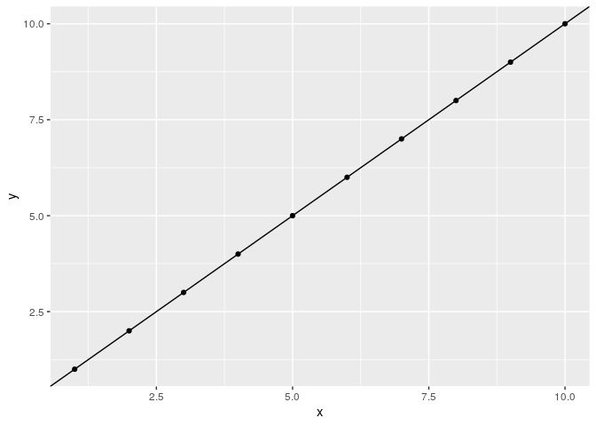

Chapter 3
================
Mauro

# A Review of the Predictive Modeling Process

<http://www.feat.engineering/review-predictive-modeling-process.html>

## Overview

### 1\. Measure model performance

#### 1.1. Numeric variables

Measure regression between observed and predicted outcome

  - RMSE: Root Mean Squared Error

  - R^2: Coefficient of determination

#### 1.2. Discrete variables: Classification

  - Black or white

  - Probability

### 2\. Use data well (e.g. splitting and resampling)

### 3\. Tune models

### 4\. Compare model performance

# Measuring performance

# Measuring performance of Numeric variables

## Measuring performance: Numeric variables

  - Root Mean Squared Error (RMSE)

  - Coefficient of determination (R^2)

**Spoiler: Both very sensitive to extreeme values**

  - Good to predict the rank of the response

  - Not so good to predict the response itself

Robust approaches:

  - transform the data to reduce the impact of extreeme values
    (e.g. rank order)

Not covered, just mentioned:

  - median absolute deviation (MAD)

  - absolute error.

## RMSE | Root Mean Squared Error

**Spoiler: Use it\!**

  - actual vs. predicted: average distance

  - \[original\]

  - Good -\> RMSE \~ 0

## R^2 | Coefficient of determination

**Spoiler: Don’t use it; prefer RMSE\!**

  - actual vs. predicted: (standard correlation)^2

## R^2 | Coefficient of determination: Pro

For linear models:

  - \~ How much variability can the model explain?

  - \[none\] (proportion):
    
      - Good -\> R^2 \~ 1
      - Bad -\> R^2 \~ 0

## R^2 | Coefficient of determination: Con

  - can show very optimistic results when the y has large variance.

  - a handful of far predicted can artificially increase R^2.

  - Measures correlation not accuracy. (Main problem.)

## R^2 Measures correlation not accuracy

> a model could produce predicted values that have a strong linear
> relationship with the actual values but the predicted values do not
> conform to the 45-degree line of agreement.

## R^2 Measures correlation not accuracy

> E.g. when a model under-predicts at one extreme of the y and
> overpredicts at the other extreme of the y.

## R^2 problem: book example

(I don’t get it)


## Concordance Correlation Coefficient (CCC)

  - CCC penalizes R^2 for its bias (R^2 \* bias)

## 

# Measuring performance of discrete variables

## Measuring performance of discrete variables

Confusion matrix


### Balanced: Accuracy

Proportion of correctly predicted = correct / total

### Imbalanced: Kappa

Normalizes the error rate to what would be expected by chance.

### Mozaic plot


### 2 classes

Takeaway:

  - Forget about metrics based on hard class predictions

  - Focus on the AUC (area under the curve) of ROC and precision-recall
    to find a reasonable model.

  - Then examine the curves carefully to find a reasonable cutoff.

  - Finally use qualitative prediction metrics (whatever this means?)

What follos next are details:

#### Hard classes (1 or 0)

  - Sensitivity (\#1\~1 / \#1) & Specificity (\#0\~0 / \#0)

  - Precision (\#1\~1 / \#\~1) & recall = Sensitivity

ASK: Mentions Bayesian statistics in “hard classes”, why?

#### Soft classes (probability or 1)


  - What probability cutoff should you use? It depends …

#### ROC (receiver operating characteristic) considers all possible cutoffs (see mozaic plot)


Area Under Curve (AUC):

  - 1)  ROC \~0.84 (1 = best; 0.5 = worst)

  - 2)  Precision-recall \~0.6 (1 = best; prevalence (0.18) = worst)

### Context-specific metrics

Careful\! How we measure the model’s performance depends on the question
we want to answer.

# Data splitting

Commonly you would split the data in two:

1.  A subset to “train” the model: i.e. to develop the model and the set
    of features you should use.

2.  A subset to “test” the model: i.e. to estimate if the model is good
    or bad. **Do not use it before this final stage**.

How much data should you put in each subset?

  - It’s hard to say.

  - Depends mostly on how many samples (n) you have relative to the
    number of predictions (p) you want to make.

  - No matter how large is your sample, best is for the number of
    predictions to be lower. Else you are in trouble.

How do you decide which samples to put where (train or test subset)?

  - It’s most common to do it at random; but not alwasy is best.

  - For discrete variables, select samples at random within each class
    (i.e. “stratified random based on the outcome”).

  - For numeric variables, first group the data in quartiles, then split
    each quartile into train and test subsets, finally pool all train
    and test groups. (Presumably at random ASK)

Sometimes it’s best to sample non-randomly, e.g. when the data depends
on time you may allocate the most recent data to the test set.

# Resampling

How can you know if a model is good before you even test it?


It’s kind of the same thing but with different names. The answer is to
“resample” (\~split) your data into (a) an analysis set (\~training)
and (b) an assessment set (\~test).

Tipes of resampling:

  - V-Fold Cross-Validation and Its Variants
  - Monte Carlo Cross-Validation
  - The Bootstrap
  - Rolling Origin Forecasting


# Appendix

## R^2 problem: my example

``` r
library(tidyverse)
#> ── Attaching packages ──────────────────────── tidyverse 1.3.0 ──
#> ✓ ggplot2 3.3.0           ✓ purrr   0.3.4      
#> ✓ tibble  3.0.1           ✓ dplyr   0.8.99.9002
#> ✓ tidyr   1.0.2           ✓ stringr 1.4.0      
#> ✓ readr   1.3.1           ✓ forcats 0.5.0
#> ── Conflicts ─────────────────────────── tidyverse_conflicts() ──
#> x dplyr::filter() masks stats::filter()
#> x dplyr::lag()    masks stats::lag()

actual <- tibble::tibble(x = 1:10, y = 1:10)

p <- ggplot(actual, aes(x, y)) + 
  geom_point(data = actual) +
  geom_abline()
p
```

<!-- -->

``` r
predicted <- tibble::tribble(
  ~x, ~y,
  # under-predict
  0,   2,  
  1,   3,
  2,   4,
  # over-predict
  8,   6,  
  9,   7,
  10,   8,
)

p + geom_point(data = predicted, color = "red")
```

<!-- -->

``` r
compare <- inner_join(
  actual, predicted, 
  by = "x", 
  suffix = c("_actual", "_predicted")
)

compare
#> # A tibble: 5 x 3
#>       x y_actual y_predicted
#>   <dbl>    <int>       <dbl>
#> 1     1        1           3
#> 2     2        2           4
#> 3     8        8           6
#> 4     9        9           7
#> 5    10       10           8
```

``` r
compare %>% 
  ggplot(aes(y_actual, y_predicted)) +
  xlim(0, 10) +
  ylim(0, 10) +
  geom_abline(slope = 1) +
  geom_point() +
  geom_smooth(method = "lm")
#> `geom_smooth()` using formula 'y ~ x'
```

<!-- -->
